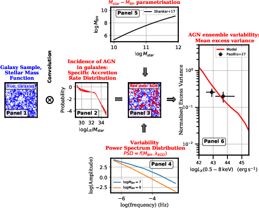

========================================
AGN Ensemble Variability Empirical Model 
========================================

This project provides routines to model the ensemble excess variance of AGN using as input emprical relations and quantities. These inlcude the stellar mass function of galaxies, the specific accretion-rate distribution of AGN, the black-hole mass vs stellar-mass scaling relation and the Power Spectrum Density of the AGN flux variations. The data used by these routines can be found at https://zenodo.org/record/4725121. The flow-chart below shows how these components are combined to make predictions on the ensemble excess variance of AGN populations.

A galaxy sample drawn from the stellar mass function at a given redshift (Panel 1) is seeded with AGN specific accretion-rates using observationally-derived probability distribution functions (Panel 2). This produces a sample of mock AGN (red dots of Panel 3), each of which has been assigned an X-ray luminosity, a host-galaxy stellar mass and a redshift. A parametrisation of the Black-Hole Mass vs Stellar Mass relation (Panel 5) is used to assign black holes to mock AGN and hence, Eddington ratios. The dependence of the AGN variability Power Spectrum Density (PSD; Panel 4) on Black Hole Mass and Eddington ratio is then used to assign an excess variance by integrating the corresponding PSD. The average excess variance of the population binned in luminosity and redshift intervals (Panel 6) can then be directly compared with observational results.

The python modules include an Empirical Model (`EmpMo`) class that takes as input mock catalogues of AGN (minimum required information is stellar mass, X-ray luminosity, redshift of each source) and estimates their excess variances. Examples on how to use this class are provided in the form of jupyter notebooks (folder notebook).  

FORTRAN90 routines for the empirical model are also provided within the FORTAN subdirectory. These are used in combination with the MultiNest library to infer model parameters, e.g. PSD and/or black-hole mass stellar-mass relation. 
